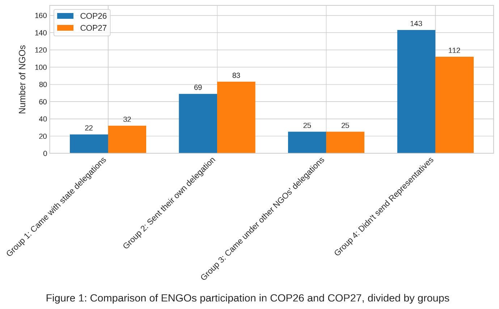
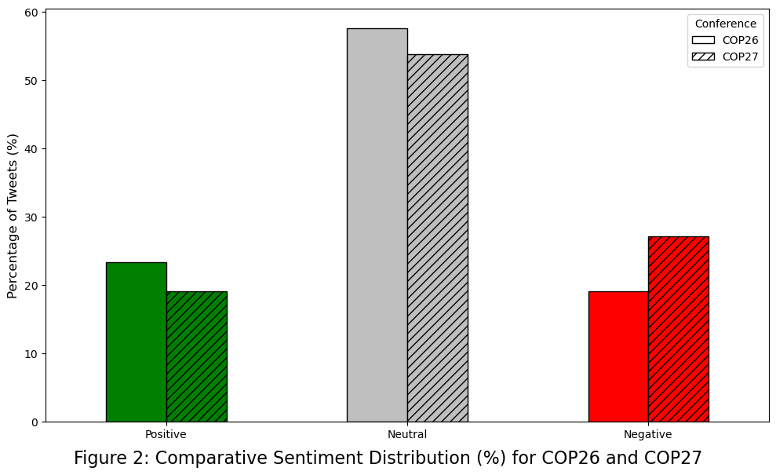
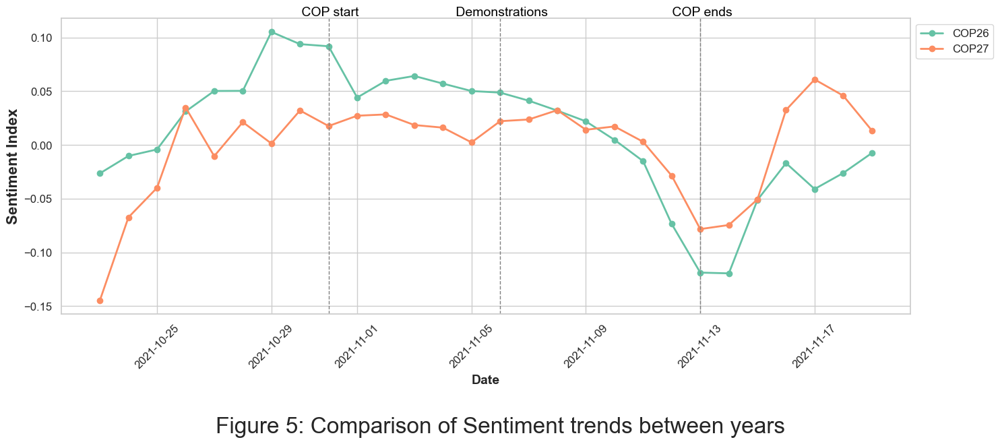

# Environmental NGOs' Emotional Framing During UN Climate Conferences

## A Sentiment Analysis of Twitter Posts During COP26 and COP27

This repository contains the code and analysis for my MA thesis examining how Environmental Non-Governmental Organizations (ENGOs) use emotional framing in their Twitter communications during the UN Climate Change Conferences (COP26 and COP27).

## Abstract

Emotions play an essential role in Environmental Non-Governmental Organization (ENGO) messaging. ENGOs employ both positive emotions (hope, empathy) and negative emotions (guilt, anger) in their campaigns to influence environmental policy. This study broadens our understanding of how ENGOs' emotional framing is influenced by their relationships with the institutions they seek to change. The literature on environmental NGOs and social movements distinguishes between 'insider' and 'outsider' groups: insiders attempt to influence policy through direct interaction and cooperation with political elites, while outsiders use external levers of influence such as demonstrations and blame campaigns. Drawing on this distinction, the study examined ENGO Twitter activity around COP26 and COP27, classifying organizations into four categories based on their participation mode: representation in state delegations, independent representation, representation under other NGO banners, or no physical representation. Through sentiment analysis of **40,042 Twitter posts from 291 ENGOs**, complemented by newsletter analysis, the research reveals distinct temporal patterns in emotional framing across both conferences. Notably, more institutionally embedded ENGOs demonstrated more negative messaging about the COPs, challenging existing assumptions about the relationship between institutional access and confrontational messaging. These findings suggest that insider ENGOs maintain critical stances along privileged positions. 

## Research Overview

### Research Questions

1. **How has the sentimental framing by ENGOs of COP26 and COP27 changed throughout the events?**
  - Examining temporal patterns of emotional messaging during the conferences

2. **To what extent are changes in sentiment levels influenced by the ENGOs' level of proximity to discussion floors?**
  - Analyzing differences between insider and outsider organizations

### Methodology

- **Data Collection**: Twitter API extraction of ENGO posts from:
 - COP26 period: October 23 - November 19, 2021
 - COP27 period: October 29 - November 25, 2022
 
- **Sentiment Analysis**: Fine-tuned RoBERTa model trained on climate discourse
 - Model accuracy: 82%
 - Three categories: Positive, Neutral, Negative
 
- **ENGO Classification**: Four groups based on COP participation:
 1. ENGOs with representatives in state delegations
 2. ENGOs with independent representatives
 3. ENGOs represented under other NGO banners
 4. ENGOs without any representatives at the COP venues

## Key Findings

### Figure 1: ENGO Participation Patterns

*Distribution of ENGOs across four participation categories.*

### Figure 2: Sentiment Distribution Comparison

*Comparative analysis revealing a notable shift toward negative sentiment from COP26 to COP27, with negative posts increasing from approximately 35% to 45% of total content.*

### Figure 5: Temporal Sentiment Trends

*Daily sentiment index showing consistent patterns: initial optimism declining throughout both conferences, with COP26 displaying more dramatic fluctuations than COP27.*

### Main Conclusions

- **Temporal Pattern**: Both COPs showed initial positivity that declined toward the end, reflecting diminishing political opportunities for ENGO influence
- **Insider Paradox**: Insider ENGOs (Groups 1 & 2) demonstrated significantly more negative framing than outsider organizations during COP26
- **Overall Negativity**: COP27 exhibited more negative sentiment overall, possibly due to restricted civil society participation in Egypt
- **Strategic Messaging**: Most active ENGOs included both reformative organizations (We Mean Business) and confrontational groups (Greenpeace, 350.org)

